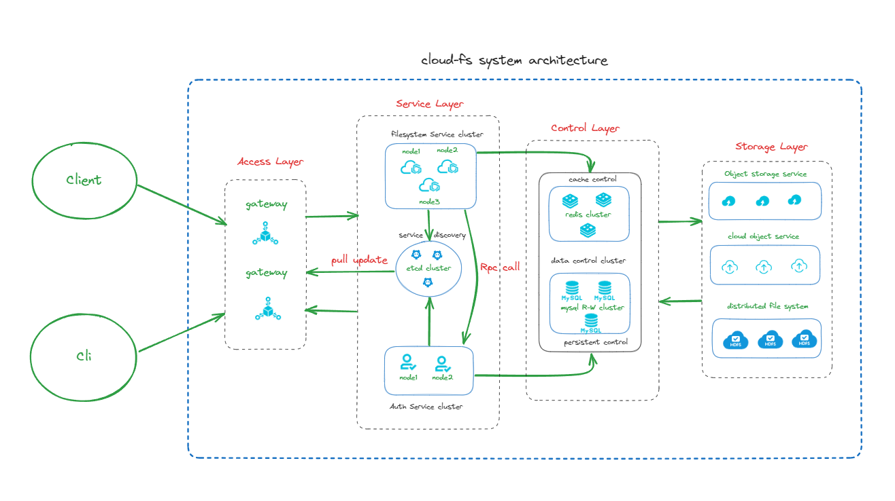

#### cloud-file-service

- 简介
  - 尝试对对象存储框架COS,OSS和分布式文件系统HDFS进行了封装作为云盘服务的储存介质层
  - 尝试使用GIN+GRPC搭建api服务和集群内部的rpc服务。
  - 尝试基于etcd实现集群内部服务的动态发现和Nginx服务注册和负载均衡。
  - 尝试在存储介质层的基础上增加了用户与认证，增加了命名空间和文件服务写时复制的机制。
  - 尝试提供基于存储介质层的对象分片上传下载机制。

- 体系架构



- UNDO
    1. 完成服务层未完成的部分
    2. 完善基于etcd的grpc客户端负载均衡
- TODO
    1. 增加对更多存储后端的支持
    2. 完整支持Oauth2认证协议
    3. 增加更多中间件支持
    4. 增加支持k8s部署
- 项目目录
```
├─common 通用库
│  ├code 验证码
│  ├─hash 哈希校验
│  ├─jwtx token
│  ├─page 分页
│  ├─upload 上传
│  ├─url 
│  └─util 
├─config 配置管理
├─container 容器管理
│  ├─etcd 配置中心集群
│  │  ├─cmd
│  │  │  └─etcd
│  │  │      ├─etcd1
│  │  │      ├─etcd2
│  │  │      └─etcd3
│  │  └─pkg
│  │      ├─discovery
│  │      ├─dlock
│  │      ├─election
│  │      ├─operator
│  │      ├─pub
│  │      └─txn
│  ├─mysql 数据库集群
│  │  ├─bin
│  │  ├─build
│  │  ├─data
│  │  ├─etc
│  │  └─tmp
│  ├─nginx 网关集群
│  │  ├─bin
│  │  │  └─daemon
│  │  └─logs
│  │      ├─go
│  │      └─nginx
│  ├─redis 缓存集群
│  │  ├─bin
│  │  ├─build
│  │  ├─data
│  │  └─etc 
│  └─var 
├─controller 控制器
├─dao model层
│  ├─cache
│  └─db
├─errors 错误码
├─etcd etcd封装
│  ├─client
│  └─server
├─implement 扩展功能 
│  └─loadbalancer
├─middleware 中间件
├─reposity 对象存储
├─router 路由管理
├─service 服务层
│  ├─auth Oauth认证
│  │  ├─api
│  │  ├─config
│  │  ├─logic
│  │  └─rpc
│  │      ├─proto
│  │      ├─server
│  │      └─types
│  ├─filesystem 文件管理
│  └─user 用户管理
└─test 测试
```